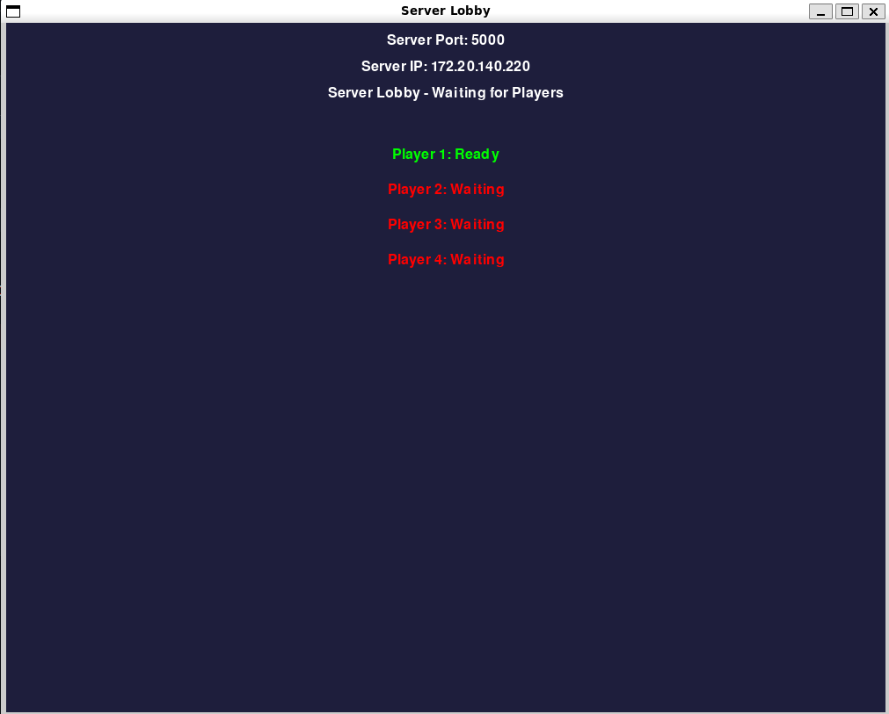
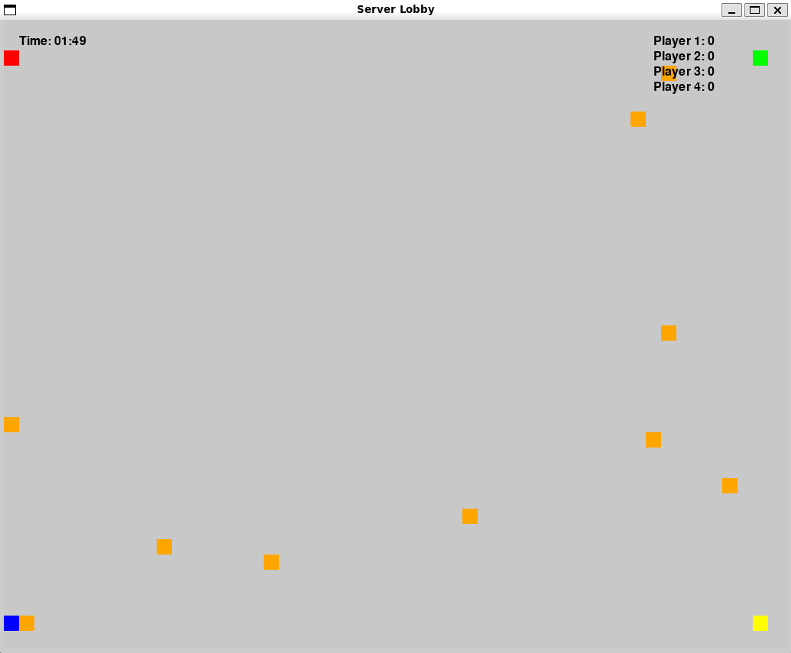
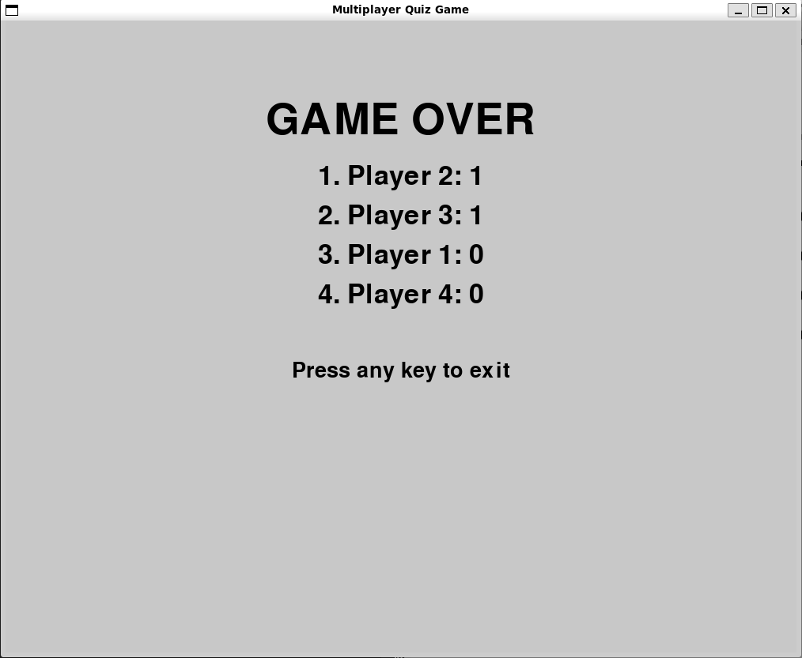

# 🎮 CMPT 371 Final Project — Multiplayer Quiz Game

## Overview

A real-time multiplayer **Quiz Game** built using **Python**, **PyGame** for 2D graphics, and **TCP sockets** for communication. One player acts as the **host server**, and others connect as **clients** to compete in a dynamic 2D world. The core gameplay involves players navigating a grid to collect **microphones** that trigger **multiple-choice quiz questions**. Correct answers score points — the highest scorer at the end of the game wins!

## 📦 Installation

Ensure **Python 3** is installed. Then:

### 1. Install PyGame
```bash
pip install pygame
```

### 2. Install `make`

**Linux:**
```bash
sudo apt update
sudo apt install build-essential
```

**macOS:**
```bash
brew install make
```

### 3. Install `ifconfig` (Linux)
```bash
sudo apt update
sudo apt install net-tools
```

## 🚀 Running the Game

### Help Menu
```bash
make help
```

### Start the Server (Host)
```bash
make start-server
```
A **lobby screen** appears and the terminal displays the server’s IP and port for clients to connect.

### Join as a Client
```bash
make join-server IP_ADDRESS=<ip> PORT=<port>
```
Use the IP and port from the server’s output.

## ⚙️ Game Configuration

Server can customize runtime behavior:

| Variable     | Description                        | Default |
|--------------|------------------------------------|---------|
| `TIME_LIMIT` | Duration of the game in seconds    | `120`   |

Example:
```bash
make start-server TIME_LIMIT=300
```

## 🎮 Gameplay

### Startup
- Host starts the game, showing IP and port.
- Clients connect, toggle “Ready”.
- 5-second countdown, then game begins.

### World
- Grid size: **50×40 tiles** (40px per tile)
- Move using **arrow keys** or **WASD**

### Objective
- Collect **microphone (yellow square)** items.
- Interact using **space bar** to open quiz.
- Correct answers:
  - Earn points
  - Remove mic
  - Spawn new quiz item randomly
- Wrong answers:
  - Quiz UI disappears
  - Brief cooldown imposed

### Game End
- Game ends when:
  - Time runs out
  - All questions used
- Final score screen shown.

## 🖼️ UI Preview

### Lobby Screen  
> Shows player readiness and connection info  


### Gameplay  
> Players (colored squares), microphones (yellow)  


### Quiz Prompt  
> Multiple-choice overlay when mic is triggered  


### Game Over  
> Displays all players’ final scores  



## 🧠 Architecture

### 🔹 Frontend (Client UI)
- PyGame-based rendering
- Player: colored square
- Microphones: yellow squares
- Quiz UI: translucent overlay with options

### 🔹 Backend (Server)
- Manages all **game state**: scores, positions, mic locations, time
- Handles **client threads** separately
- Ensures concurrency using **mutex locks** on mic objects

### 🔹 Networking
- Built on **TCP sockets**
- Custom **JSON-based messaging** for:
  - Movement
  - Interaction
  - Quiz questions/answers
  - Game synchronization

## 📨 Message Protocol (Application-Layer)

Messages exchanged as JSON with a `type` field. Examples:

| Type           | Direction        | Purpose |
|----------------|------------------|---------|
| `init`         | Server → Client  | Game initialization info |
| `lobby_state`  | Server → All     | Players' ready states |
| `question`     | Server → Client  | Sends quiz content |
| `answer`       | Client → Server  | Sends answer index |
| `answer_result`| Server → Client  | Result (correct/incorrect) |
| `game_over`    | Server → All     | Sends final scores |

## 🧪 Debug Tips

If server doesn’t launch due to IP config issues:

```bash
export IP_ADDRESS=$(ifconfig | grep -Eo 'inet (addr:)?([0-9]*\.){3}[0-9]*' | grep -Eo '([0-9]*\.){3}[0-9]*' | grep -v '127.0.0.1')
make start-server IP_ADDRESS=${IP_ADDRESS}
```

## Demo Showcasing 

**Demo Video:**  
[Watch here](https://www.youtube.com/watch?v=V33iYo7v39g)

## 🤝 Group Members

| Name              | SFU ID      |
|-------------------|-------------|
| JunHang Wu        | 301435761   | 
| Yuhao (Allen) Gao | 301545007   |
| Adam Siergiej     | 301562042   | 
| Uros Kovacevic    | 301544276   |

## 📚 References

- [Python Socket Docs](https://docs.python.org/3/library/socket.html)
- [PyGame Docs](https://pygame.readthedocs.io/en/latest/1_intro/intro.html)
- [Python Pickle Module](https://docs.python.org/3/library/pickle.html)
